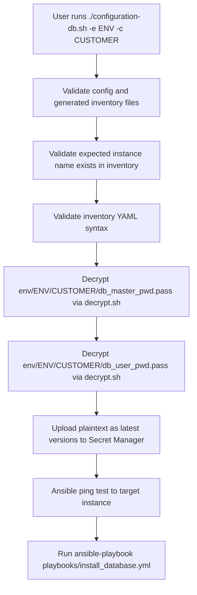

# Ansible Configuration Diagram

Source flow references:
- `configuration-db.sh`
- `ansible/playbooks/install_database.yml`
- `ansible/roles/postgresql/tasks/*.yml`
- `ansible/roles/gcp_secrets/tasks/read_db_secrets.yml`
- `ansible/roles/postgresql/templates/*.j2`
- `ansible/roles/postgresql/templates/sql/setup_application_database.sql.j2`

```mermaid
flowchart TD
  A[install_database.yml] --> B[Pre-task: display db_type]
  B --> C[Pre-task: fail unless db_type == postgres]
  C --> D[Role: postgresql]

  D --> D0[00_set_facts.yml]
  D0 --> D01[Set pg_* facts from defaults]
  D0 --> D02[Load config_file YAML]
  D0 --> D03[Parse inventory hostname for environment and customer]
  D0 --> D04[Load env/common-config.yml]
  D0 --> D05[Build secret suffix from region/env/customer]
  D0 --> D06[Read master secret via gcp_secrets/read_db_secrets.yml]
  D0 --> D07[Read user secret via gcp_secrets/read_db_secrets.yml]

  D --> E[01_preflight_checks.yml]
  E --> E1[Check root filesystem size]
  E --> E2[Warn if less than 20GB]
  E --> E3[Fail if less than 10GB]

  D --> F[02_install_packages.yml]
  F --> F1[Install PGDG repo RPM]
  F --> F2[Disable built-in postgresql module]
  F --> F3[Install EPEL repository]
  F --> F4[Install PostgreSQL server and contrib and libs and psycopg2]
  F --> F5[Install vim and wget and net-tools and tar and gzip]

  D --> G[03_initialize_database.yml]
  G --> G1[Stop service if running]
  G --> G2[Check PG_VERSION and base dir]
  G --> G3[Remove corrupted cluster if needed]
  G --> G4[Run postgresql-setup initdb when needed]
  G --> G5[Fix ownership and restorecon]
  G --> G6[Create backup and log directories]

  D --> H[04_configure_postgresql.yml]
  H --> H1[Compute memory settings from db.memory_mb]
  H --> H2[Template postgresql.conf]
  H --> H3[Remove deprecated stats_temp_directory line]
  H --> H4[Template pg_hba.conf]
  H --> H5[Ensure ownership on data directory]
  H --> H6[Notify handler restart postgresql]

  D --> I[05_start_service.yml]
  I --> I1[Enable service]
  I --> I2[Start service]
  I --> I3[Wait for port 5432]
  I --> I4[pg_isready retries until ready]

  D --> J[06_set_passwords.yml]
  J --> J1[Assert master and user passwords loaded]
  J --> J2[ALTER USER postgres WITH PASSWORD from secret]

  D --> K[07_create_database.yml]
  K --> K1[Assert user password loaded]
  K --> K2[Render setup_application_database.sql.j2]
  K --> K3[Execute SQL: create DB if missing]
  K --> K4[Create user or alter user password]
  K --> K5[Grant DB privileges if missing]

  D --> L[08_verify_installation.yml]
  L --> L1[Verify systemd service active]
  L --> L2[Verify pg_isready localhost]
  L --> L3[Collect psql version]
  L --> L4[Display install summary]

  L --> M[Post-task: completion banner in playbook]
```

Secret retrieval internals (`gcp_secrets/read_db_secrets.yml`):
- Resolve latest enabled secret version with `gcloud secrets versions list`.
- Read secret value with `gcloud secrets versions access`.
- Store into runtime fact (`db_master_password` or `db_user_password`).

Handlers:
- `restart postgresql` and `reload postgresql` in `ansible/roles/postgresql/handlers/main.yml`.
