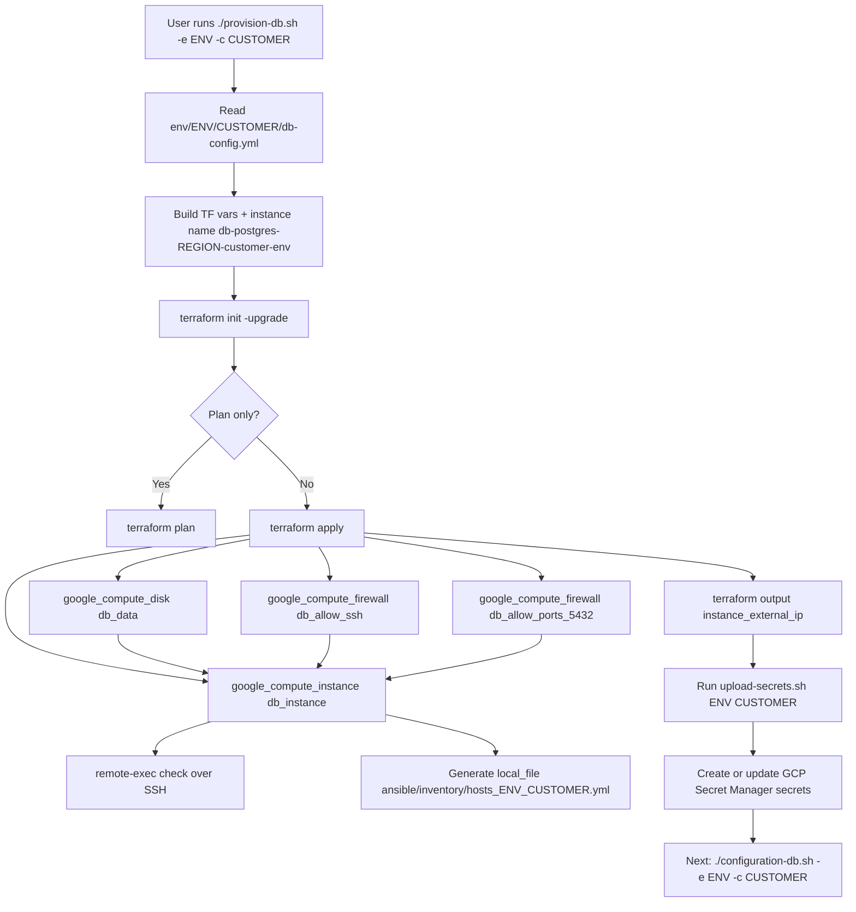
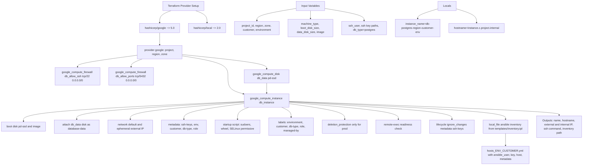

# Terraform Provisioning Diagram

Source flow references:
- `provision-db.sh`
- `terraform/provider.tf`
- `terraform/variables.tf`
- `terraform/main.tf`
- `terraform/outputs.tf`
- `terraform/templates/inventory.tpl`

Notes:
- `zone` is passed as input, but instance and data disk currently use `"${var.region}-a"` in `terraform/main.tf`.
- Inventory consumed by scripts is static `hosts_ENV_CUSTOMER.yml` generated by Terraform.
